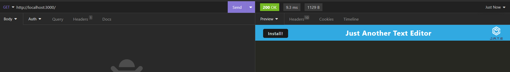

# Just Another Text Editor

## Description

The purpose for this website is to build a text editor that works in the browser that meets the PWA criteria. Through this application, I was able to better understand how to store and retrieve data.

## Table of Contents (Optional)

If your README is long, add a table of contents to make it easy for users to find what they need.

- [Installation](#installation)
- [Usage](#usage)
- [Credits](#credits)
- [License](#license)

## Installation

All installations should already be provided/ installed.

Only thing required is to `npm i`

## Usage

To use, simply go to the live link provided and the user is able to edit code within the browser and save their progress.

To use in the CLI, type `npm run start` and use an application like Insomnia to run the application. Make sure to go type in the url bar `http://localhost:3000/`

## Credits

N/A

## License

N/A

## Badges

N/A

## Features

N/A

## How to Contribute

N/A

## Tests

To test the application, install `npm i jest` and then in the CLI type `npm run test`